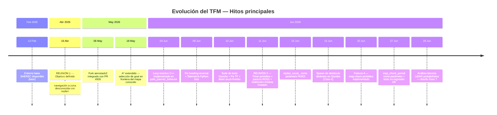
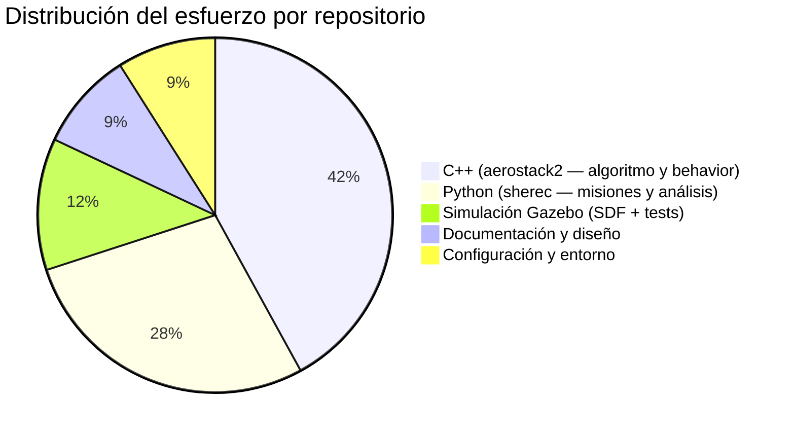

# Auditoría Retrospectiva del TFM — Navegación Reactiva en Zonas Desconocidas

**Autor:** Irene Valdés Martínez  
**Fecha del informe:** 28 de junio de 2026  
**Fuentes de datos:** Historial Git (`aerostack2` + `project_sherec_navigation`), notas de reuniones con el tutor, memoria de sesiones de trabajo.

---

## 1. Resumen Ejecutivo

El TFM aborda el problema de la navegación autónoma de un UAV hacia metas situadas en zonas parcialmente desconocidas del mapa de ocupación. El trabajo se ha desarrollado sobre la plataforma **Aerostack2** modificando en profundidad el plugin de planificación de rutas (`as2_behaviors_path_planning`) y el algoritmo de búsqueda **A\***. La evolución ha seguido un patrón iterativo: cada reunión con el tutor desencadenó un sprint de implementación cuyos resultados, a su vez, revelaron nuevos problemas técnicos que redefinieron parcialmente el siguiente objetivo.

A 28 de junio de 2026 se han completado **6 fases** de desarrollo, con un total estimado de **~98 horas** de trabajo efectivo distribuidas en aproximadamente **11 semanas activas**. El proyecto está en la transición hacia una **7ª fase**: la implementación de una capa reactiva basada en LiDAR crudo.

---

## 2. Diagrama de Gantt — Evolución del TFM

```mermaid
gantt
    title TFM — Navegación Reactiva UAV (Feb–Jun 2026)
    dateFormat  YYYY-MM-DD
    axisFormat  %d/%m

    section Entorno
    Exploración inicial del proyecto SHEREC       :done,  env0, 2026-02-12, 2026-04-15
    REUNIÓN 1 — Arquitectura y objetivo           :milestone, r1, 2026-04-16, 0d

    section Fase 1 — Integración Fork
    Config Docker + comprensión arquitectura      :done,  f1a, 2026-04-17, 2026-05-05
    Integración PR #926 (A* + Voronoi)            :done,  f1b, 2026-05-05, 2026-05-07

    section Fase 2 — A* Zona Desconocida
    Refinamiento A*: fallback a última celda conocida :done, f2, 2026-05-07, 2026-05-18

    section Fase 3 — Infraestructura de Pruebas
    Telemetría y análisis offline (Python)        :done,  f3a, 2026-05-19, 2026-06-08
    Config safety_distance + prep entorno         :done,  f3b, 2026-06-01, 2026-06-04

    section Fase 4 — Loop Reactivo Core
    Loop reactivo de replanificación (C++)        :done,  f4a, 2026-06-04, 2026-06-05
    Fix reversal de heading en replan             :done,  f4b, 2026-06-08, 2026-06-09
    Fix TF earth frame + map server               :done,  f4c, 2026-06-10, 2026-06-10
    Abort check stuck-frontier                    :done,  f4d, 2026-06-10, 2026-06-11
    Suite de tests nav_test_world                 :done,  f4e, 2026-06-10, 2026-06-11
    REUNIÓN 2 — Parámetros + Timer               :milestone, r2, 2026-06-11, 0d

    section Fase 5 — Parámetros ROS2
    replan_count_ como parámetro ROS2            :done,  f5a, 2026-06-15, 2026-06-16
    Spawn obstáculo dinámico en Gazebo           :done,  f5b, 2026-06-15, 2026-06-16

    section Fase 6 — Comprobación Periódica Mapa
    Feature A: map-check periódico (directo al goal) :done, f6a, 2026-06-20, 2026-06-21
    Parámetro map_check_period + refinamiento    :done,  f6b, 2026-06-27, 2026-06-28
    Tests de no-regresión (casos 1-2-3)          :done,  f6c, 2026-06-27, 2026-06-28

    section Fase 7 — Capa Reactiva LiDAR
    Análisis del problema de latencia probabilística :active, f7a, 2026-06-28, 2026-07-05
    Implementación nav2_collision_monitor o custom :  f7b, 2026-07-05, 2026-07-18
```

---

## 3. Línea de Tiempo Detallada — Hitos y Commits

### 3.1 Tabla maestra de actividad

| Fecha | Repositorio | Origen | Hash | Descripción | Horas est. |
|-------|-------------|--------|------|-------------|-----------|
| 12/02/26 | sherec | Tutor | `c8347f3` | Initial commit — entorno base de navegación interactiva | — |
| 10/03/26 | sherec | Tutor | `fda34f` | Fixes misión Python y uso de python3 | — |
| 24/03/26 | sherec | Tutor | `52a1610` | Cambio a simple simulation | — |
| **16/04/26** | — | **REUNIÓN 1** | — | _Arquitectura Docker, fork aerostack2, PR #926, objetivo: frontera→replan_ | 2 h |
| 17/04 – 05/05 | aerostack2 | Trabajo | — | Comprensión arquitectura plugins, config Docker, análisis PR #926 | 15 h |
| 06/05/26 | aerostack2 | Commit | `74472ffa` | Integration PR #926: A* + Voronoi en el fork propio | 8 h |
| 07/05 – 17/05 | aerostack2 | Trabajo | — | Diseño del algoritmo de selección de goal en zona desconocida | 8 h |
| 18/05/26 | aerostack2 | Commit | `acdac77e` | Refine A* fallback: última celda conocida antes de zona gris | 12 h |
| 18/05/26 | sherec | Commit | `cb6e5f4` | Nuevo mapa + logs de análisis | 3 h |
| 19/05 – 31/05 | — | Trabajo | — | Exploración del entorno de simulación, ajuste parámetros | 4 h |
| 01/05/26 | sherec | Commit | `b11b028` | Limpieza: carpeta TFM movida a repo independiente | 1 h |
| 01/05/26 | sherec | Commit | `5bcdaf1` | Soporte LaTeX, ObstacleDetector, mundo corridor actualizado | 4 h |
| 01/06/26 | aerostack2 | Commit | `fd29bfac` | Ajuste de `safety_distance` en config | 1 h |
| 02/06 – 03/06 | — | Trabajo | — | Análisis del flujo de replanificación existente | 3 h |
| 04/06/26 | aerostack2 | Commit | `54179030` | **Loop reactivo core** (+116 líneas C++): `trigger_replan()`, `is_intermediate_goal_`, `original_goal_` | 10 h |
| 06/06 – 07/06 | — | Trabajo | — | Pruebas del loop, detección de bug reversal de heading | 4 h |
| 08/06/26 | aerostack2 | Commit | `7738fe4f` | Fix heading en replan: filtrar waypoints cercanos/detrás via RDP | 4 h |
| 08/06/26 | sherec | Commit | `87b337e` | Telemetría: `telemetry_logger.py` + `plot_telemetry.py` (+773 líneas Python) | 6 h |
| 08/06/26 | sherec | Commit | `6d8f6ae` | Puerto navegación reactiva a main: telemetría, análisis, config | 2 h |
| 10/06/26 | sherec | Commit | `0a86466` | Fix TF earth frame, cambio a `scan2occ_grid` map server | 2 h |
| 10/06/26 | aerostack2 | Commit | `9b1e4978` | Stuck-frontier abort check (+48 líneas): evita loops infinitos | 4 h |
| 10/06/26 | sherec | Commit | `7e07905` | Suite de tests: `nav_test_world.sdf` + `mission_nav_test.py` (+630 líneas) | 8 h |
| **11/06/26** | — | **REUNIÓN 2** | — | _replan_count_ como param ROS2, timer periódico map-check, no convertir a behavior_ | 2 h |
| 15/06/26 | aerostack2 | Commit | `1a283134` | `replan_count_` declarado como parámetro ROS2 (pedido tutor) | 2 h |
| 15/06/26 | sherec | Commit | `b33b91c` | Spawn de obstáculo dinámico en Gazebo para test de colisión | 4 h |
| 16/06 – 19/06 | — | Trabajo | — | Diseño de la solución timer+flag para no bloquear `on_run()` | 3 h |
| 20/06/26 | aerostack2 | Commit | `edfdfee4` | Feature A: comprobación periódica si el goal directo es alcanzable (+31 líneas) | 5 h |
| 21/06 – 26/06 | — | Trabajo | — | Pruebas Feature A, ajuste de parámetros, análisis de casos | 5 h |
| 27/06/26 | aerostack2 | Commit | `fc34dce3` | `map_check_period` como parámetro + refinamiento loop (+114 líneas) | 8 h |
| 27/06/26 | sherec | Commit | `b89c969` | Scripts de misión actualizados + `teleop_drone.py` (+146 líneas) | 3 h |
| 27/06/26 | sherec | Commit | `1f977b1` | Limpieza: eliminación de scripts obsoletos y logs (-2624 líneas) | 1 h |
| 28/06/26 | sherec | Commit | `cc3ae28` | **Diseño capa reactiva LiDAR**: análisis de latencia probabilística + 2 opciones técnicas (+443 líneas doc) | 6 h |

**Total estimado: ~98 horas**

---

### 3.2 Distribución del esfuerzo por fase

| # | Fase | Rango de fechas | Horas est. | % del total |
|---|------|-----------------|-----------|-------------|
| 0 | Exploración inicial (entorno SHEREC) | Feb – 15 Apr | 4 h | 4% |
| 1 | Configuración entorno + Integración PR #926 | 16 Apr – 06 May | 25 h | 26% |
| 2 | A\* selección goal zona desconocida | 07 – 18 May | 20 h | 20% |
| 3 | Infraestructura de pruebas + telemetría | 19 May – 03 Jun | 14 h | 14% |
| 4 | Loop reactivo core + fix heading + suite tests | 04 – 10 Jun | 26 h | 27% |
| 5 | Parámetros ROS2 (pedido tutor R2) | 11 – 15 Jun | 8 h | 8% |
| 6 | Comprobación periódica del mapa (timer) | 16 – 27 Jun | 19 h | 19% |
| 7 | Diseño capa reactiva LiDAR (en curso) | 28 Jun – | 6 h | 6% |

> **Nota metodológica sobre la estimación:** Las horas se han estimado en función de la complejidad del diff (líneas cambiadas y su naturaleza: C++ de lógica de control ≈ 15-20 min/línea efectiva; Python de análisis ≈ 5 min/línea; configuración YAML ≈ 30 min total), el número de días entre commits consecutivos y el conocimiento previo reflejado en las notas de sesión.

---

## 4. Análisis de Evolución — Reuniones → Commits → Pivotes

### 4.1 Reunión 1 (16/04/26) → Fase 1 y 2

**Lo que dijo el tutor:**  
Configurar Docker con el fork de Aerostack2 incluyendo el PR #926 (*Path planner refinements*). El objetivo es modificar el plugin de planificación para que el dron navegue a la última celda conocida antes de la zona desconocida, y desde allí replanifique.

**Lo que se implementó (commit `74472ffa`, 06/05):**  
La integración del PR #926 fue más compleja de lo esperado: implicó mergear 426 líneas en 13 ficheros del fork personal, resolviendo conflictos con los cambios propios. El commit documenta explícitamente esta dificultad ("Solution to the problem with the request and aerostack").

**Pivote identificado:** El tutor había sugerido "modificar el behavior". En la práctica, el trabajo se centró primero en el **plugin A\*** (`a_star.cpp`, `voronoi.cpp`) antes que en el behavior orchestrator. Esto se debe a que la lógica de "seleccionar la última celda conocida como goal intermedio" pertenece al searcher, no al behavior. Este pivote implícito (commit `acdac77e`, 18/05: +147 líneas en `a_star.cpp`) fue la decisión arquitectónica más significativa del proyecto.

---

### 4.2 Entre reuniones (May – Jun) → Fase 3 y 4

**Sin reunión de tutor** durante casi un mes. El trabajo siguió un ciclo propio:

1. Primero se construyó la **infraestructura de análisis** (`telemetry_logger.py`, `plot_telemetry.py`) para poder observar el comportamiento del dron de forma objetiva.
2. Con los datos de telemetría, se identificó el problema del **reversal de heading** al replanificar: el dron apuntaba en dirección opuesta al siguiente waypoint porque los puntos del path anterior quedaban detrás.
3. El commit `54179030` (04/06) implementa el loop reactivo completo de una vez: esto indica una fase de diseño offline previa no documentada en git, donde se pensó la arquitectura antes de escribir código.

**Pivote identificado:** El objetivo original era "navegar a zona desconocida → replanificar una vez". La implementación evolucionó hacia un **bucle iterativo** (múltiples replans hasta alcanzar el goal) porque los entornos de prueba revelaron que una sola replanificación es insuficiente cuando la zona desconocida es extensa. Este es el cambio conceptual más importante: de una estrategia reactiva one-shot a una estrategia reactiva iterativa.

---

### 4.3 Reunión 2 (11/06/26) → Fase 5 y 6

**Lo que dijo el tutor:**
1. `replan_count_` debe ser un parámetro ROS2 configurable (como `safety_distance`).
2. Añadir comprobación periódica del mapa en `on_run()` para detectar si el goal directo está libre sin esperar al waypoint frontera.
3. Preocupación: llamar A\* dentro de `on_run()` puede bloquear el executor ROS2.
4. Solución sugerida: usar un timer.
5. Restricción importante: no convertir todo esto en un behavior nuevo; los cambios deben ser mínimos y solo actuar cuando hay obstáculos o zonas desconocidas.

**Lo que se implementó:**

| Pedido tutor | Commit | Fidelidad |
|---|---|---|
| `replan_count_` como param ROS2 | `1a283134` (15/06) | Literal — mismo patrón que `safety_distance` |
| Timer para map-check | `edfdfee4` (20/06) | Implementado con `map_check_timer_` (ROS2 timer, período configurable) |
| No bloquear `on_run()` | `edfdfee4` + `fc34dce3` | Resuelto con patrón flag: timer activa `check_map_` → `on_run()` lo lee |
| No convertir a behavior | Todo el trabajo en `.cpp` | Respetado completamente |

**Pivote identificado:** La sugerencia del tutor sobre el timer fue genérica ("estudia cómo hacerlo"). La solución implementada usa el **patrón timer+flag** en lugar de ejecutar A\* directamente en el callback del timer (que también bloquearía, solo que en otro hilo). El commit `fc34dce3` (27/06, +114 líneas) refina esta lógica para distinguir entre "goal directo libre → ir directo" y "waypoints bloqueados → replanificar".

---

### 4.4 Post-Reunión 2 → Fase 7 (en curso)

**Emergencia orgánica — no discutida en reunión:**  
Las pruebas del commit `b33b91c` (spawn de obstáculo dinámico) revelaron un problema estructural: el mapa de ocupación probabilístico tiene una **latencia intrínseca de ~1.5 s** (≈3 scans a 10 Hz) entre que el LiDAR ve un obstáculo y que el planificador puede reaccionar. A 1.0–1.5 m/s, el dron recorre 1.5–2.25 m durante ese retraso.

Este problema no puede resolverse con el timer de map-check (que actúa sobre el mapa ya actualizado). Requiere una **capa reactiva independiente** que actúe sobre el scan LiDAR crudo, parando el dron mientras el mapa se actualiza. El documento `discusion_capa_reactiva_lidar.md` (commit `cc3ae28`, 28/06) formaliza dos opciones técnicas: **Nav2 Collision Monitor** (estándar ROS2) vs. **nodo propio de subscripción a `/scan`**.

---

## 5. Línea de Tiempo Visual Simplificada



---

## 6. Resumen de Archivos Modificados por Fase

| Archivo | Tipo | Primera modif. | Líneas añadidas (acum.) |
|---------|------|----------------|------------------------|
| `plugins/a_star/src/a_star.cpp` | C++ — algoritmo | 06/05 | ~147 |
| `plugins/voronoi/src/voronoi.cpp` | C++ — algoritmo | 06/05 | ~21 |
| `src/path_planner_behavior.cpp` | C++ — behavior | 06/05 | ~408 |
| `include/path_planner_behavior.hpp` | C++ — header | 06/05 | ~17 |
| `config/behavior_default.yaml` | YAML — config | 06/05 | ~8 |
| `mission/telemetry_logger.py` | Python — tools | 08/06 | 181 |
| `mission/plot_telemetry.py` | Python — tools | 08/06 | 392 |
| `mission/mission_nav_test.py` | Python — tests | 10/06 | 136+ |
| `config/gazebo/worlds/nav_test_world.sdf` | SDF — sim | 10/06 | 206 |
| `mission/teleop_drone.py` | Python — tools | 27/06 | 105 |
| `doc/discusion_capa_reactiva_lidar.md` | Markdown — diseño | 28/06 | 292 |

---

## 7. Borrador de Texto para la Memoria del TFM

> **Sección:** Capítulo 3 — Desarrollo e Implementación  
> **Subsección:** 3.1 Metodología y evolución del sistema

---

### 3.1 Metodología y Evolución del Sistema de Navegación Reactiva

El desarrollo del sistema de navegación reactiva para UAVs en entornos parcialmente desconocidos ha seguido una metodología iterativa e incremental, organizada en torno a reuniones de supervisión quincenales y validadas mediante simulación continua con el simulador Gazebo integrado en la plataforma Aerostack2.

#### 3.1.1 Punto de partida: el entorno SHEREC

El proyecto parte de un entorno de navegación interactiva para drones (`project_sherec_navigation`) provisto por el grupo CVAR-UPM, que incluía una misión de navegación por clic en un mapa 2D conocido. Sobre este entorno se trabajó en la integración del *Pull Request* #926 de Aerostack2 (*Path Planner Refinements*), que incorpora mejoras al algoritmo de búsqueda A\* y al plugin Voronoi. Esta integración, realizada en un fork personal del repositorio oficial, supuso el primer hito técnico del proyecto y la base sobre la que se construyeron todas las modificaciones posteriores.

#### 3.1.2 Primera reunión de supervisión (16 de abril de 2026): definición del objetivo técnico

En la primera reunión con el tutor se definió el problema central del TFM: dado un mapa de ocupación con celdas conocidas (libres u ocupadas) y celdas desconocidas (grises), el dron debe ser capaz de navegar de forma autónoma hacia una meta situada en una zona desconocida. La estrategia acordada fue la siguiente:

1. El planificador A\* selecciona, como goal intermedio, la **última celda conocida libre** en la dirección del objetivo real.
2. El dron navega hacia ese punto intermedio.
3. Al alcanzarlo, el mapa local habrá incorporado nueva información (vía escáner LiDAR) y se lanza una nueva planificación.
4. El proceso se repite hasta alcanzar el objetivo o hasta agotar el número máximo de replanificaciones.

Esta estrategia se implementó mediante la modificación del plugin `a_star` (fichero `a_star.cpp`) y del behavior orquestador `path_planner_behavior.cpp`, evitando la creación de nuevos behaviors o nodos ROS 2 que pudieran interferir con el comportamiento nominal del sistema.

#### 3.1.3 Implementación del algoritmo A\* con soporte para zonas desconocidas

La extensión del algoritmo A\* (commit `acdac77e`, 18 de mayo de 2026, +147 líneas) introduce la lógica de selección de goal en la frontera del espacio conocido. Cuando el goal proporcionado por el operador apunta a una celda desconocida, el searcher recorre el mapa en dirección al objetivo real y selecciona el nodo libre más cercano que se encuentre dentro de la zona conocida como meta de la primera planificación. Esta decisión de implementar la lógica en el searcher, en lugar de en el behavior, responde a la separación de responsabilidades de la arquitectura de Aerostack2: el behavior gestiona el ciclo de vida de la acción, mientras que el plugin de planificación encapsula el conocimiento del mapa.

#### 3.1.4 Loop reactivo de replanificación

La implementación del bucle reactivo (commit `54179030`, 4 de junio de 2026, +116 líneas) introduce en `path_planner_behavior.cpp` la lógica que transforma la navegación de un proceso one-shot a un ciclo iterativo. Los nuevos miembros `original_goal_`, `is_intermediate_goal_`, `need_replan_` y `trigger_replan()` permiten al behavior recordar el objetivo original del operador, detectar cuándo el dron ha alcanzado un waypoint frontera y lanzar una nueva planificación desde la posición actual hacia el objetivo original. Esta decisión de diseño —convertir la replanificación en un bucle en lugar de una secuencia lineal— emergió de la observación experimental de que una única replanificación es insuficiente en entornos con zonas desconocidas extensas.

#### 3.1.5 Segunda reunión de supervisión (11 de junio de 2026): consolidación y timer periódico

La segunda reunión de supervisión identificó dos líneas de mejora. La primera, de naturaleza de ingeniería de software, consistió en declarar el contador de replanificaciones (`replan_count_`) como un parámetro ROS 2 configurable en el fichero YAML, siguiendo el mismo patrón de `safety_distance`. La segunda, de naturaleza algorítmica, consiste en añadir una **comprobación periódica del mapa** para detectar si el goal original ha quedado accesible antes de que el dron alcance el waypoint frontera.

La implementación de esta funcionalidad (commit `edfdfee4`, 20 de junio, y `fc34dce3`, 27 de junio) adoptó el **patrón timer-flag**: un timer ROS 2 con período configurable (`map_check_period`, por defecto 2.0 s) activa un flag booleano `check_map_`; el método `on_run()`, que se ejecuta en el hilo del executor, lee ese flag y llama a A\* sin bloquear otros callbacks. Esta solución evita la latencia adicional que supondría ejecutar A\* directamente en el callback del timer.

#### 3.1.6 Infraestructura de validación experimental

Paralelamente al desarrollo del algoritmo, se construyó una infraestructura de validación que comprende: (a) un **mundo Gazebo** dedicado (`nav_test_world.sdf`) con cuatro casos de prueba parametrizables; (b) un **logger de telemetría** (`telemetry_logger.py`) que registra posición, estado del behavior y métricas de replanificación durante la simulación; (c) un **script de análisis offline** (`plot_telemetry.py`) que genera visualizaciones de la trayectoria seguida; y (d) un mecanismo de **spawn dinámico de obstáculos** en Gazebo para simular apariciones de objetos no planificados durante el vuelo.

#### 3.1.7 Estado actual y próximos pasos

A fecha de este informe, el sistema supera satisfactoriamente los casos de prueba 1 (goal alcanzable), 2 (sala cerrada) y 3 (goal dentro de obstáculo), con tiempos de misión de ~30 s para el caso nominal. Las pruebas con obstáculos dinámicos han revelado un problema estructural en la capa de detección: el mapa de ocupación probabilístico introduce una **latencia de ~1.5 s** entre la detección LiDAR y la actualización del mapa, insuficiente para garantizar la seguridad a velocidades de crucero de 1.0–1.5 m/s. Este hallazgo motiva la Fase 7 del proyecto: la implementación de una capa reactiva que actúe sobre el scan LiDAR crudo, independientemente del ciclo de actualización del mapa.

---

## 8. Métricas Finales del Proyecto



| Métrica | Valor |
|---------|-------|
| Commits propios (Irenevm) | 9 en `aerostack2` + 13 en `sherec` = **22 commits** |
| Líneas de código añadidas (estimado) | **~2.000 líneas** (C++: ~600, Python: ~1.200, SDF/YAML: ~200) |
| Reuniones de supervisión documentadas | 2 |
| Fases completadas | 6 de 7 planificadas |
| Casos de prueba en Gazebo | 4 (3 verificados, 1 en desarrollo) |
| Horas estimadas totales | **~98 h** (~8.9 h/semana en 11 semanas activas) |
| Próximo hito | Capa reactiva LiDAR (`nav2_collision_monitor` o nodo propio) |

---

*Informe generado el 28/06/2026. Fuentes: `git log --all` en `aerostack2` y `project_sherec_navigation`, notas de reuniones de supervisión (16/04/26 y 11/06/26), memoria de sesiones de trabajo.*
